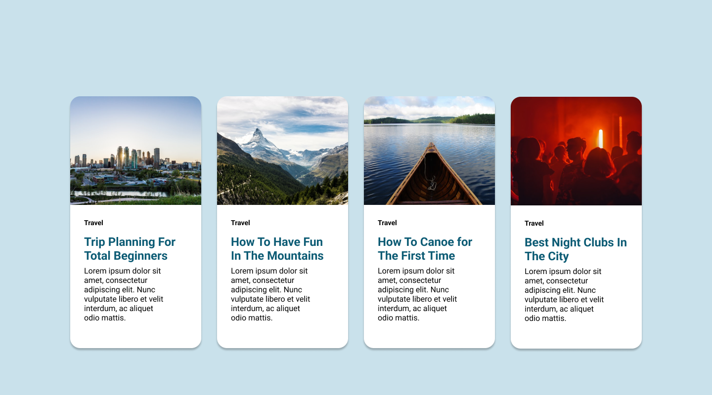

# Simple Cards Using Flexbox

**This is a simple project that uses CSS Flexbox to build a responsive card layout**

My main rationale for doing this is to get started with web development.

Using the html, css and image files will produce the following website:

To view the site live, simply go to:

[https://loquacious-kulfi-0c415c.netlify.app/